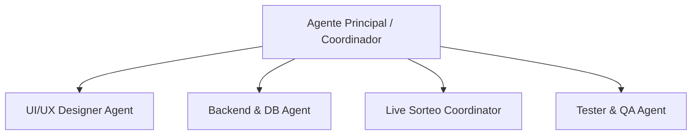

# Definición de Subagentes (agentes.md)

Para garantizar la máxima calidad en el desarrollo de la plataforma de rifas, utilizaremos un enfoque multi-agente donde cada uno asume un rol especializado.

## Roles de Agentes Definidos

### 1. UI/UX Designer Agent (Diseñador)
- **Objetivo**: Asegurar que la interfaz sea visualmente espectacular (Premium, moderna, responsive).
- **Enfoque**: Estilos CSS, animaciones del reloj, diseño de la ruleta, vista móvil impecable y consistencia de marca (dorado y negro).
- **Herramientas principales**: CSS, React components, SVG.

### 2. Backend & DB Agent (Base de datos y API)
- **Objetivo**: Diseñar la lógica del negocio, relaciones de tablas e integraciones de correo y almacenamiento.
- **Enfoque**: Modelos de base de datos (boletos, rifas, usuarios, premios), endpoint de carga de imágenes para comprobantes, y generación segura de boletos.
- **Herramientas principales**: Node.js, Prisma, SQL.

### 3. Live Sorteo Coordinator (Real-time)
- **Objetivo**: Controlar la sincronización en vivo del sorteo.
- **Enfoque**: Implementar la comunicación instantánea por websockets. Asegurar que al presionar "Iniciar Sorteo", todos los clientes conectados reciban el aviso de inicio y visualicen el giro de la ruleta al mismo tiempo.

### 4. Tester & QA Agent (Control de Calidad)
- **Objetivo**: Probar flujos críticos y registrar cualquier fallo.
- **Enfoque**: Validar que un boleto no verificado no pueda ganar, verificar la carga correcta de comprobantes pesados y asegurar la precisión del temporizador animado.
